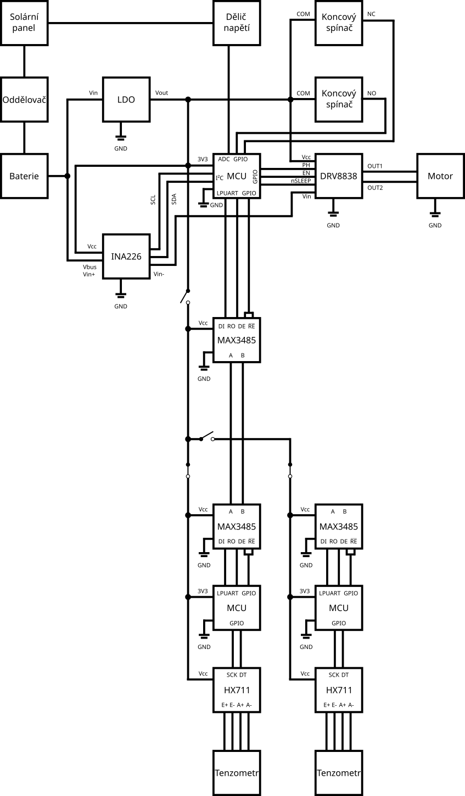
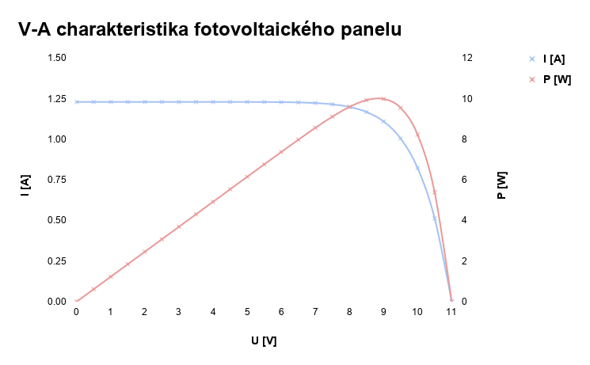
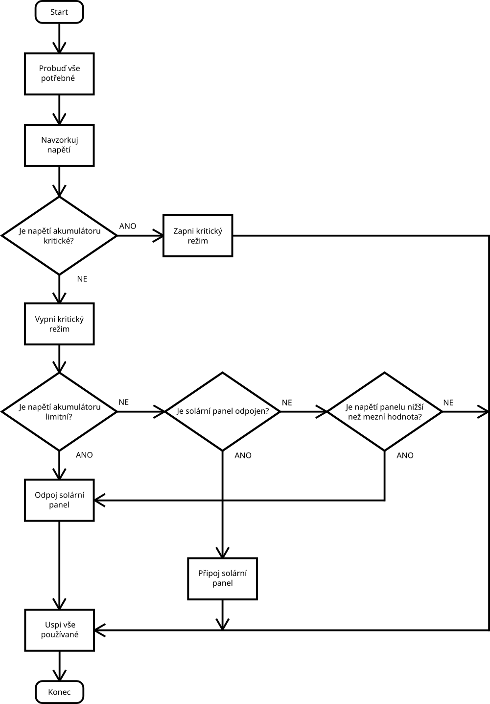
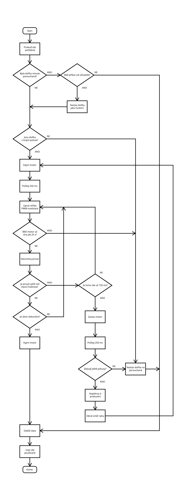
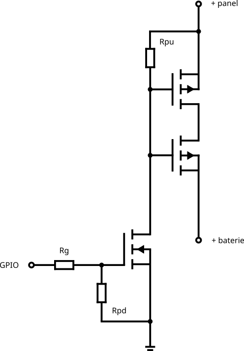
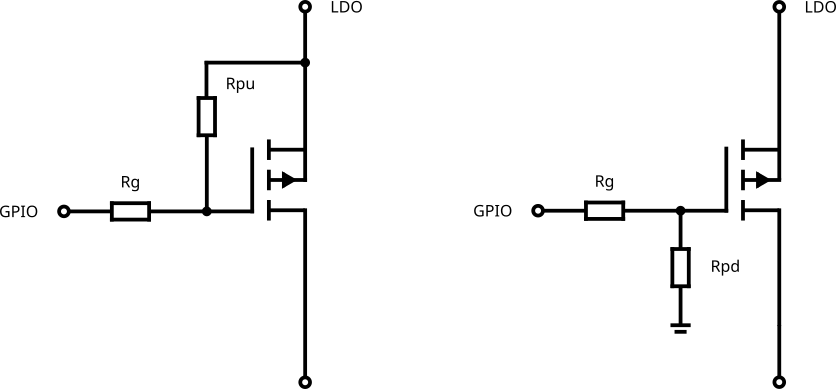

# Kurník

Systém pro automatizaci kurníku s detekcí snesených vajec

&nbsp;

## Zadání

&nbsp;

- Prostudujte možnosti automatizace uzavírání kurníku, možné metody detekce snesených vajec a dostupné možnosti komunikace a připojení zařízení do IoT sítě (např. NB-IoT, WiFi, LoRaWAN).
- Navrhněte systém pro automatické otevírání a uzavírání dvířek kurníku s možností rozšíření o jednotky se senzory ve snáškových hnízdech (min. 5 hnízd). Prostudujte možnosti napájení z akumulátoru nebo fotovoltaického panelu. Proveďte analýzu možnosti přenosu dat do cloudu a jejich zobrazení uživateli včetně historie snášek a možnosti vzdáleného ovládání, například skrze aplikaci.
- Na základě analýzy navrhněte způsob vzdálené uživatelské interakce pro zobrazení stavu dvířek, manuální ovládání a počítání snesených vajec.
- Navrhněte schéma zařízení, které bude obsahovat mikrořadič, komunikační modul, senzory, řízení dvířek, napájecí/nabíjecí obvody. Dbejte na nízký příkon celého zařízení. Proveďte návrh desky plošných spojů.
- Zkonstruujte hardwarovou realizaci navrženého systému. Osaďte a zprovozněte řídicí elektroniku. Vytvořte ovládací firmware. Realizujte přenos dat ze zařízení k uživateli včetně ovládacího rozhraní a možnosti zobrazení historie.
- Ověřte funkčnost systému experimentálním měřením a vyhodnoťte spolehlivost detekce a ovládání.
- Zveřejněte veškeré výrobní podklady na vhodné platformě (např. GitHub).

&nbsp;

## Schéma

&nbsp;

<picture>
  <source media="(prefers-color-scheme: dark)" srcset="Schematics/block_schematic_white.png">
  <source media="(prefers-color-scheme: light)" srcset="Schematics/block_schematic_black.png">
  
</picture>

&nbsp;

### Legenda  
K - hlavní krabička  
Kx - hnízdová krabička  
M - hlavní mikrořadič  
Mx - hnízdový mikrořadič  

&nbsp;

## Popis

&nbsp;

### Kabeláž
Pro připojení solárního panelu a akumulátoru je použita měděná ohebná licna o průřezu 1,5 mm², připojená přes 4pinovou pružinovou WAGO svorkovnici s roztečí 5,08 mm k desce plošných spojů. Tento průřez poskytuje dostatečnou proudovou rezervu při minimálním úbytku napětí. Stejným způsobem je k desce plošných spojů připojen motor a mikrospínače, avšak s licnou o průřezu 0,5 mm² a motor přes 2pinovou svorkovnici.

Kabely vedou v klasické elektroinstalační PVC liště o rozměrech 15 × 10 mm, upevněné k betonové stěně pomocí vrutů 3 × 30 mm a hmoždinek o průměru 5 mm — dostatečně prostorné, a přitom minimalistické řešení. Speciální UV odolná lišta není potřeba, protože stěna kurníku, na které jsou lišty umístěny, je vystavena slunci pouze při jeho západu; životnost běžné lišty se odhaduje na 5–10 let.

Pro datovou komunikaci byl zvolen kabel UTP CAT5e typu licna, upevněný k betonové stěně pomocí 6mm šroubovacích příchytek, vrutů 4 × 20 mm a hmoždinek o průměru 6 mm. K deskám plošných spojů je připojený přes konektory RJ45.

Prodloužení vodičů tenzometru zajišťuje stíněný kabel LiYCY 4 × 0,25 mm², spojený přes pružinové WAGO svorky. Protože jsou vodiče od tenzometru (průřez 0,14 mm²) pro tyto svorky příliš tenké, přehnou se u odizolovaného konce napůl, čímž se jejich efektivní průřez zdvojnásobí na 0,28 mm². K desce plošných spojů je tento kabel spolu se stíněním připojen přes 6pinovou pružinovou WAGO svorkovnici s roztečí 2,54 mm.

Oplet kabelu (pocínované měděné drátky) se izoluje smršťovací bužírkou 2:1 o vnitřním průměru 4 mm / 1,75 mm. Odmotaný a spletený oplet je potřeba oddělit od zbylých čtyř vodičů a bužírku navléknout až ke kořenu; přes celý kabel se pak přetáhne bužírka 2:1 o rozměru 7,5 mm / 3,5 mm, přečnívající asi centimetr přes hlavní izolaci.

U prototypu jsou využity stejné kabely, svorkovnice a svorky. Dále jsou použity drátky do nepájivého pole o průřezu 0,5 mm², který plně vyhovuje proudovému odběru systému.

&nbsp;

### Napájení
Výrobu energie zajišťuje fotovoltaický panel s parametry Voc = 11 V / Vmpp = 9 V / Isc = 1,23 A / Impp = 1,11 A. Panel je svisle připevněný na stěnu mimo výběh pod malou stříškou a orientovaný na jih, případně na východ nebo západ (v tomto případě na jihozápad), aby co nejlépe využíval dostupnou sluneční energii. Vertikální montáž mimo výběh zároveň omezuje usazování sněhu a nečistot. Tento panel byl zvolen proto, že při použití jednoduchého MOSFET odpojovače poskytuje vhodný poměr mezi napěťovou rezervou pro nabíjení 6V akumulátoru a dostupným nabíjecím proudem; panel je schopen reálně dodat maximálně kolem 1,2 A, tudíž je přesně na hranici nejvyššího povoleného nabíjecího proudu akumulátoru (1,2 A). Jeho vyšší výkon navíc zvyšuje energetickou rezervu systému v zimě, kdy je intenzita slunečního záření nízká. Vlivem teplotních ztrát a nepatrného úbytku napětí na krátké kabeláži je účinnost panelu přibližně 95 %.

&nbsp;

<picture>
  <source media="(prefers-color-scheme: dark)" srcset="Plots/panel_characteristic_white.png">
  <source media="(prefers-color-scheme: light)" srcset="Plots/panel_characteristic_black.png">
  
</picture>

&nbsp;

Systém je napájen z bezúdržbového olověného AGM akumulátoru 6 V / 4 Ah, umístěného venku ve stínu asi 25 cm pod stříškou. Jeho nabíjecí účinnost je přibližně 88 %, samovybíjení činí 3 % měsíčně a v zimě akumulátor ztrácí přibližně 30 % kapacity. Tento typ nesmí být hluboce vybíjen, což je kvůli velmi nízké spotřebě systému splněno. Akumulátor typu LiFePO4 je sice v mnoha ohledech kvalitnější, nesmí se však nabíjet při teplotě pod 0 °C a vyžaduje složitější nabíjecí systém. Vzhledem k venkovnímu umístění (zvolenému kvůli snížení vlivu amoniaku ze slepičího trusu na elektroniku) a požadavku na jednoduchý nabíjecí systém je pro celoroční provoz vhodnější olověný akumulátor. Je důležité mít na paměti životnost kolem 5 let a roční ztrátu kapacity 15 %. Napájecí kabely jsou připojeny přes konektory Faston F1.

Před akumulátorem je zapojen nízkopříkonový, mikrořadičem řízený MOSFET odpojovač fotovoltaického zdroje s ochranou akumulátoru. Od použití MPPT regulátoru se ustoupilo kvůli vyšší složitosti a vlastní spotřebě spínaného měniče — u systému s velmi nízkým denním odběrem by zlepšení účinnosti nabíjení, probíhajícího jen několik minut denně, nepřineslo oproti jednoduchému odpojovači s téměř nulovou klidovou spotřebou žádný významný energetický přínos. Účinnost pracovního bodu dosahuje 81,6 %, neboť akumulátor stahuje napětí panelu na svou úroveň (průměrně 6,8 V) a panel tak nepracuje v bodě maximálního výkonu, ale v oblasti konstantního proudu; účinnost MOSFET odpojovače dosahuje 96,5 %.

Silová část systému pracuje s napětím 6 V, veškerá elektronika pak s napětím 3,3 V. Snížení napětí zajišťuje nízkopříkonový LDO regulátor MCP1702 s přesnou stabilizací, dostačujícím výstupním proudem 250 mA a velmi nízkým klidovým proudem. Na jeho vstupu i výstupu je připojen blokovací keramický kondenzátor 1 µF / 50 V — na vstupu jako filtrace, na výstupu pro stabilizaci napětí. Použití spínaného buck měniče není vhodné kvůli horší dostupnosti nízkopříkonových variant a velmi nízkému odběru systému po většinu dne. Jeho vyšší účinnost by se projevila jen po několik minut denně a kvůli vlastní spotřebě by měnič paradoxně dosahoval nižší celkové účinnosti než jednoduchý lineární LDO regulátor.

&nbsp;

## Denní přehled (5 hnízd)

&nbsp;

### Klidová spotřeba (24 h / 2–10 h)

&nbsp;

| Komponenta | Proud (typ) | Proud (max) | Spotřeba (typ) | Spotřeba (max) |
|:---|:---:|:---:|:---:|:---:|
| LDO (MCP1702) | 2 µA | 5 µA | 48 µAh | 120 µAh |
| INA226 (shutdown) | 0,6 µA | 2,5 µA | 14,4 µAh | 60 µAh |
| DRV8838 (shutdown) | 80 nA | 120 nA | 1,92 µAh | 2,88 µAh |
| Spínač (N) | 7,1 µA | 7,1 µA | 14,2 µAh | 71 µAh |
| Spínače (leak) | 1,1 µA | 5,1 µA | 26,4 µAh | 122 µAh |
| M (Stop2 s RTC) | 1 µA | 26 µA | 24 µAh | 624 µAh |
| **Celkem** | **11,9 µA** | **45,8 µA** | **129 µAh** | **1 mAh** |

&nbsp;

$$
I_N = \frac{U_{nap}}{R_{pd} + R_G} + I_{GSS} = \frac{3,3\ \text{V}}{470\ \text{k}\Omega + 220\ \Omega} + 100\ \text{nA} \approx \mathbf{7,1\ \text{µA}}
$$

$$
I_{leak,min} = I_{DSS,min} + I_{GSS} = 1\ \mu\text{A} + 100\ \text{nA} = \mathbf{1,1\ \mu\text{A}}
$$

$$
I_{leak,max} = I_{DSS,max} + I_{GSS} = 5\ \mu\text{A} + 100\ \text{nA} = \mathbf{5,1\ \mu\text{A}}
$$

&nbsp;

kde:
- $I_N$ ... proud tekoucí pull-down rezistorem u spínače s N-MOS tranzistorem
- $U_{nap}$ ... napájecí napětí
- $R_{pd}$ ... pull-down rezistor o hodnotě 470 kΩ
- $R_G$ ... ochranný rezistor
- $I_{leak,min}$ ... minimální svodový proud spínačů s P-MOS tranzistorem
- $I_{leak,max}$ ... maximální svodový proud spínačů s P-MOS tranzistorem
- $I_{DSS,min}$ ... minimální svodový proud spínačů s P-MOS tranzistorem tekoucí přes drain
- $I_{DSS,max}$ ... maximální svodový proud spínačů s P-MOS tranzistorem tekoucí přes drain
- $I_{GSS}$ ... svodový proud tekoucí přes gate

&nbsp;

U MOSFET odpojovače přispívá do spotřeby pouze pull-down rezistor při sepnutí N-MOS tranzistoru (2–10 hodin denně — nabíjení akumulátoru) a svodový proud tekoucí do gate N-MOS tranzistoru (celý den); přes ochranný rezistor teče proud pouze po velmi krátkou dobu, a to při změně stavu spínače. U větve zodpovědné za kontrolu vajec je 6 spínačů s P-MOS tranzistorem s pull-up rezistorem a 5 spínačů s P-MOS tranzistorem s pull-down rezistorem. Největší část spotřeby spínačů s P-MOS tranzistorem s pull-up rezistorem tvoří svodové proudy tekoucí přes drain při jejich rozepnutí (téměř celý den) a svodové proudy tekoucí přes gate (celý den); ty tekoucí přes gate jsou při sepnutí zanedbatelné. Všemi těmito šesti spínači teče tentýž svodový proud. U spínačů s P-MOS tranzistorem s pull-down rezistorem tečou svodové proudy pouze po přivedení napájecího napětí, tedy zanedbatelnou dobu.

&nbsp;

### Kontrola fotovoltaického panelu a akumulátoru (30 s a 12 s)

&nbsp;

| Komponenta | Proud (typ) | Proud (max) | Spotřeba (typ) | Spotřeba (max) |
|:---|:---:|:---:|:---:|:---:|
| INA226 | 330 µA | 420 µA | 1,01 µAh | 1,28 µAh |
| M (LP Run @ 1 MHz) | 120 µA | 390 µA | 1,4 µAh | 4,55 µAh |
| **Celkem** | **450 µA** | **810 µA** | **2,41 µAh** | **5,83 µAh** |

&nbsp;

$$
t_{p,v} = n_{p,v} \cdot \frac{n_{c,v} + n_{c,p}}{f_{clk}} = 16 \cdot \frac{160,5 + 12,5}{500\ \text{kHz}} = 16 \cdot 346\ \text{µs} = 5,54\ \text{ms}
$$

$$
t_p = 144 \cdot (t_u + t_{p,v}) = 144 \cdot (200\ \text{ms} + 5,54\ \text{ms}) \approx \mathbf{30\ \text{s}}
$$

$$
t_a = 144 \cdot n_{a,v} \cdot t_{a,v} = 144 \cdot 64 \cdot 1,1\ \text{ms} \approx 144 \cdot 80\ \text{ms} \approx \mathbf{12\ \text{s}}
$$

&nbsp;

kde:
- $t_p$ ... doba měření napětí na panelu
- $t_u$ ... doba ustálení napětí na panelu
- $t_{p,v}$ ... doba vzorkování napětí na panelu
- $n_{p,v}$ ... počet vzorků napětí na panelu
- $n_{c,v}$ ... počet cyklů hodin ADC pro odebrání vzorku
- $n_{c,p}$ ... počet cyklů hodin ADC pro převod
- $f_{clk}$ ... frekvence hodin ADC
- $t_a$ ... doba měření napětí na akumulátoru
- $t_{a,v}$ ... doba převodu jednoho vzorku napětí na akumulátoru
- $n_{a,v}$ ... počet vzorků napětí na akumulátoru

&nbsp;

### Pohyb dvířek (32–215 s)

&nbsp;

| Komponenta | Proud (typ) | Proud (max) | Spotřeba (typ) | Spotřeba (max) |
|:---|:---:|:---:|:---:|:---:|
| Motor | 100 mA | 250 mA | 0,889 mAh | 14,9 mAh |
| DRV8838 | 340 µA | 600 µA | 3,02 µAh | 35,8 µAh |
| INA226 | 330 µA | 420 µA | 2,93 µAh | 25,1 µAh |
| M (LP Run @ 1 MHz) | 120 µA | 390 µA | 1,07 µAh | 7,17 µAh |
| **Celkem** | **101 mA** | **251 mA** | **0,896 mAh** | **15 mAh** |

&nbsp;

$$
O_s = \pi \cdot d_s = \pi \cdot 25\ \text{mm} = 78,5\ \text{mm}
$$

$$
v_{min} = f_{min} \cdot O_s = \frac{15\ \text{rpm}} {60} \cdot 78,5\ \text{mm} = 19,6\ \text{mm/s}
$$

$$
v_{max} = f_{max} \cdot O_s = \frac{17\ \text{rpm}} {60} \cdot 78,5\ \text{mm} = 22,3\ \text{mm/s}
$$

$$
t_{min} = 2 \cdot \frac{h}{v_{max}} = 2 \cdot \frac{35\ \text{cm}}{22,3\ \text{mm/s}} = 2 \cdot 15,7\ \text{s} \approx \mathbf{32\ \text{s}}
$$

$$
t_{max} = n_u \cdot n_p \cdot 2 \cdot \frac{h}{v_{min}} = 2 \cdot 3 \cdot 2 \cdot \frac{35\ \text{cm}}{19,6\ \text{mm/s}} = 12 \cdot 17,9\ \text{s} \approx \mathbf{215\ \text{s}}
$$

&nbsp;

kde:
- $t_{max}$ ... maximální čas potřebný pro otevření a zavření dvířek
- $n_u$ ... počet událostí (otevření ráno a zavření večer)
- $n_p$ ... počet pokusů pro otevření/zavření dvířek
- $t_{min}$ ... minimální čas potřebný pro otevření a zavření dvířek
- $v_{max}$ ... maximální rychlost otáčení špulky
- $v_{min}$ ... minimální rychlost otáčení špulky
- $f_{max}$ ... maximální frekvence otáčení špulky
- $f_{min}$ ... minimální frekvence otáčení špulky
- $O_s$ ... obvod špulky
- $d_s$ ... průměr špulky
- $h$ ... výška dvířek

&nbsp;

Mikrospínače spotřebovávají málo energie, a to jen velmi krátkou dobu; výpočet astronomických hodin trvá pouze jednu milisekundu.

&nbsp;

### Kontrola vajec (24 min / 16 min / 8–8,53 min)

&nbsp;

| Komponenta | Proud (typ) | Proud (max) | Spotřeba (typ) | Spotřeba (max) |
|:---|:---:|:---:|:---:|:---:|
| M (LP Run @ 1 MHz) | 120 µA | 390 µA | 16,0 µAh | 55,5 µAh |
| MAX3485 (M) | 1,1 mA | 2,2 mA | 147 µAh | 313 µAh |
| MAX3485 (Mx) | 1,1 mA | 2,2 mA | 147 µAh | 313 µAh |
| Mx (LP Run @ 131 kHz) | 32 µA | 37 µA | 4,27 µAh | 5,26 µAh |
| HX711 a tenzometr | 4,4 mA | 4,4 mA | 587 µAh | 626 µAh |
| Spínače (P,pu) | 33 µA | 33 µA | 13,2 µAh | 13,2 µAh |
| Spínače (P,pd) | 33 µA | 33 µA | 8,8 µAh | 8,8 µAh |
| **Celkem** | **6,82 mA** | **9,29 mA** | **0,923 mAh** | **1,34 mAh** |

&nbsp;

$$
t = t_i + t_v = 0,5\ \text{s} + \frac{32}{10} = 0,5\ \text{s} + 3,2\ \text{s} = 3,7\ \text{s} \approx \mathbf{4\ \text{s}}
$$

$$
t_{min} = 24 \cdot h \cdot t = 24 \cdot 5 \cdot 4\ \text{s} = \mathbf{8\ \text{min}}
$$

$$
t_r = 2 \cdot h \cdot t_v = 2 \cdot 5 \cdot 3,2\ \text{s} = 32\ \text{s}
$$

$$
t_{max} = 24 \cdot h \cdot t + t_r = 24 \cdot 5 \cdot 4\ \text{s} + 32\ \text{s} = \mathbf{8,53\ \text{min}}
$$

$$
I_P = \frac{U_{nap}}{R_{pull} + R_G} = \frac{3,3\ \text{V}}{100\ \text{k}\Omega + 220\ \Omega} \approx \mathbf{33\ \text{µA}}
$$

$$
t_{P,pu} = 24 \cdot t_{P,pu,on} = 24 \cdot (20\ \text{s} + 16\ \text{s} + 12\ \text{s} + 8\ \text{s} + 4\ \text{s}) = \mathbf{24\ \text{min}}
$$

$$
t_{P,pd} = 24 \cdot t_{P,pd,off} = 24 \cdot (16\ \text{s} + 12\ \text{s} + 8\ \text{s} + 4\ \text{s}) = \mathbf{16\ \text{min}}
$$

&nbsp;

kde:
- $t_{max}$ ... maximální doba každohodinové kontroly h hnízd
- $t_r$ ... čas navíc při aktualizaci referenční nulové hodnoty h tenzometrů
- $t_{min}$ ... minimální doba každohodinové kontroly h hnízd
- $t$ ... doba kontroly jednoho hnízda
- $t_i$ ... doba inicializace
- $t_v$ ... doba vzorkování
- $I_P$ ... proud tekoucí pull-down/pull-up rezistorem u spínačů s P-MOS tranzistorem
- $U_{nap}$ ... napájecí napětí
- $R_{pull}$ ... pull-up/pull-down rezistor o hodnotě 100 kΩ
- $R_G$ ... ochranný rezistor
- $t_{P,pu}$ ... čas, po který teče proud ochrannými a pull-up rezistory spínačů s P-MOS tranzistorem
- $t_{P,pu,on}$ ... čas, po který jsou spínače s P-MOS tranzistorem s pull-up rezistorem sepnuty
- $t_{P,pd}$ ... čas, po který teče proud ochrannými a pull-down rezistory spínačů s P-MOS tranzistorem
- $t_{P,pd,off}$ ... čas, po který jsou spínače s P-MOS tranzistorem s pull-down rezistorem rozepnuty

&nbsp;

STM32 NUCLEO-L031K6, MAX3485, HX711 a tenzometr jsou přítomny v každé krabičce Kx, ale díky chytrému využití tranzistorových spínačů je zapnuté vždy jen to, co zrovna pracuje, což znamená několikanásobně nižší spotřebu. Využito je šest spínačů s P-MOS tranzistorem a pull-up rezistorem a pět spínačů s P-MOS tranzistorem a pull-down rezistorem. Spínače s P-MOS tranzistorem s pull-up rezistorem spotřebovávají energii pouze tehdy, když probíhá kontrola vajec a jsou sepnuty (každý z nich je sepnutý jinak dlouho). Spínače s P-MOS tranzistorem s pull-down rezistorem spotřebovávají energii pouze tehdy, když probíhá kontrola vajec a jsou rozepnuty (každý z nich je rozepnutý jinak dlouho). Přes ochranné rezistory teče proud pouze po velmi krátkou dobu, a to při změně stavu spínače. Teoreticky by bylo možné namísto P-MOS spínačů s pull-down rezistorem čipy MAX3485 a HX711 uspávat. To by sice snížilo spotřebu, ale ta se pro tyto spínače pohybuje už tak velmi nízko (8,8 µAh/den).

&nbsp;

### Komunikace (20 s a 5–15 s)

&nbsp;

| Komponenta | Proud (typ) | Proud (max) | Spotřeba (typ) | Spotřeba (max) |
|:---|:---:|:---:|:---:|:---:|
| LoRa TX | 21 mA | 21 mA | 117 µAh | 117 µAh |
| LoRa RX | 4,8 mA | 4,8 mA | 6,67 µAh | 20 µAh |
| **Celkem** | **25,8 mA** | **26,1 mA** | **124 µAh** | **137 µAh** |

&nbsp;

$$
t_{v} = 24 \cdot t_{5B} + 2 \cdot t_{2B} + 120 \cdot t_{2B} = 24 \cdot 150\ \text{ms} + 2 \cdot 130\ \text{ms} + 120 \cdot 130\ \text{ms} = 19,46\ \text{s} \approx \mathbf{20\ \text{s}}
$$

$$
t_{p,min} = 146 \cdot t_{o,min} = 146 \cdot 30\ \text{ms} = 4,38\ \text{s} \approx \mathbf{5\ \text{s}}
$$

$$
t_{p,max} = 2 \cdot 146 \cdot t_{o,max} = 2 \cdot 146 \cdot 50\ \text{ms} = 14,6\ \text{s} \approx \mathbf{15\ \text{s}}
$$

&nbsp;

kde:
- $t_v$ ... doba vysílání
- $t_{5B}$ ... airtime pro preambuli + 5B + zabezpečení
- $t_{2B}$ ... airtime pro preambuli + 2B + zabezpečení
- $t_{p,min}$ ... minimální doba příjmu
- $t_{p,max}$ ... maximální doba příjmu
- $t_{o,min}$ ... minimální doba příjmového okna
- $t_{o,max}$ ... maximální doba příjmového okna

&nbsp;

CPU je většinu času v režimu Stop2 s RTC.

&nbsp;

### Procentuální rozložení a celková denní spotřeba

&nbsp;

| Blok | Spotřeba (typ) | Podíl | Spotřeba (max) | Podíl |
|:---|:---:|:---:|:---:|:---:|
| Kontrola vajec | 923 µAh | 44,5 % | 1,34 mAh | 7,7 % |
| Pohyb dvířek | 896 µAh | 43,2 % | 15 mAh | 85,8 % |
| Klidový režim | 129 µAh | 6,2 % | 1 mAh | 5,7 % |
| Komunikace | 124 µAh | 6,0 % | 137 µAh | 0,8 % |
| Kontrola panelu a baterie | 2,41 µAh | 0,1 % | 5,83 µAh | 0,0 % |
| **Celkem** | **2,07 mAh** | **100 %** | **17,5 mAh** | **100 %** |

&nbsp;

### Energie dodávaná do akumulátoru

&nbsp;

| Orientace | Léto (mAh/den) | Zima (mAh/den) |
|:---|:---:|:---:|
| Jih | 2662 | 1588 |
| Východ | 2547 | 453 |
| Západ | 2662 | 567 |
| Jihozápad | 2772 | 1248 |

&nbsp;

$$
P_{vst} = U_{aku} \cdot I_{max} = 6,8\ \text{V} \cdot 1,2\ \text{A} = 8,16\ \text{W}
$$

$$
P_{ztr} = I_{max}^2 \cdot 2 \cdot R_{DSon} = 1,2^2\ \text{A} \cdot 2 \cdot 100\ \text{m}\Omega = 288\ \text{mW}
$$

$$
U_{ztr} = I_{max} \cdot 2 \cdot R_{DSon} = 1,2\ \text{A} \cdot 2 \cdot 100\ \text{m}\Omega = 240\ \text{mV}
$$

$$
\eta_{bias} = \frac{P_{vst}}{P_{max}} = \frac{8,16\ \text{W}}{10\ \text{W}} = 0,816
$$

$$
\eta_{mos} = \frac{P_{vst} - P_{ztr}}{P_{vst}} = \frac{8,16\ \text{W} - 288\ \text{mW}}{8,16\ \text{W}} = 0,965
$$

&nbsp;

**Příklad výpočtu pro léto, jih**

&nbsp;

$$
E_{den} = \frac{E_{červen} + E_{červenec} + E_{srpen}}{\text{92 dní}} = \frac{0,7 + 0,8 + 0,9\ \text{kWh}}{92} = 26,1\ \text{Wh/den}
$$

$$
E_{aku} = E_{den} \cdot \eta_{bias} \cdot \eta_{mos} \cdot \eta_{aku} = 26,1\ \text{Wh/den} \cdot 0,816 \cdot 0,965 \cdot 0,88 = \mathbf{18,1\ \text{Wh/den}}
$$

$$
Q_{aku} = \frac{E_{aku}}{U_{aku}} = \frac{18,1\ \text{Wh/den}}{6,8\ \text{V}} = \mathbf{2662\ \text{mAh/den}}
$$

&nbsp;

kde:
- $E_{den}$ ... energie vyrobená za jeden den
- $E_{měsíc}$ ... energie vyrobená za daný měsíc
- $E_{aku}$ ... energie nabíjející akumulátor
- $\eta_{bias}$ ... účinnost pracovního bodu
- $\eta_{mos}$ ... účinnost MOSFET odpojovače
- $P_{vst}$ ... dosažitelný výkon panelu při plném osvitu v pracovním bodě daném akumulátorem
- $P_{ztr}$ ... ztrátový výkon MOSFET odpojovače
- $U_{ztr}$ ... úbytek napětí MOSFET odpojovače
- $P_{max}$ ... maximální výkon panelu při plném osvitu
- $I_{max}$ ... maximální proud panelu při plném osvitu
- $\eta_{aku}$ ... účinnost nabíjení akumulátoru
- $Q_{aku}$ ... náboj nabíjející akumulátor
- $U_{aku}$ ... průměrné napětí akumulátoru

&nbsp;

Pro zjištění výkonu fotovoltaického panelu v lokalitě kurníku byl použit nástroj PVGIS. Úbytek napětí MOSFET odpojovače nijak neovlivňuje účinnost pracovního bodu panelu, protože panel pracuje v oblasti konstantního proudu. Vliv pull-up rezistoru pro P-MOS tranzistor, svodového proudu tekoucího přes gate P-MOS tranzistoru a vnitřního odporu N-MOS tranzistoru je na účinnost MOSFET odpojovače a pracovního bodu panelu minimální. Svodový proud drainu P-MOS i N-MOS tranzistoru je ve srovnání s napájecím proudem z panelu zanedbatelný a teče pouze tehdy, když jsou spínače rozepnuty.

&nbsp;

### Energetická bilance

&nbsp;

| Orientace | Léto (mAh/den) | Zima (mAh/den) |
|:---|:---:|:---:|
| Jih | +2612 | +1538 |
| Východ | +2497 | +403 |
| Západ | +2612 | +517 |
| Jihozápad | +2722 | +1198 |

&nbsp;

$$
Q_{ztr} = Q_{aku} \cdot \frac{rate}{30} = 4\ \text{Ah} \cdot \frac{3\ \text{\\%}}{30} = \mathbf{4\ \text{mAh/den}}
$$

&nbsp;

kde:
- $Q_{ztr}$ ... náboj ztracený samovybíjením akumulátoru
- $Q_{aku}$ ... náboj akumulátoru
- $rate$ ... míra samovybíjení za měsíc

&nbsp;

Energetická bilance je rozdílem energie dodávané do akumulátoru a součtu maximální denní spotřeby a náboje ztraceného samovybíjením akumulátoru (s rezervou 50 mAh — přibližně dvojnásobek).

&nbsp;

Systém nabízí spolehlivý celoroční provoz s obrovskou energetickou rezervou nehledě na orientaci fotovoltaického panelu. I se zohledněním zimního poklesu kapacity akumulátoru o 30 % představuje jeho rezerva několik stovek dní provozu — v praxi provozní dobu omezuje spíše několik týdnů nepříznivého počasí v kombinaci s přirozeným stárnutím akumulátoru než samotná spotřeba systému a samovybíjení.

&nbsp;

### Řízení
Hlavní řídicí jednotkou systému je mikrořadič LoRa-E5 mini (M) se STM32WLE5JC a integrovaným LoRa modulem, komunikujícím přes LoRaWAN stack. Technologie LoRaWAN umožňuje na rozdíl od Wi-Fi komunikaci na velké vzdálenosti při nízké spotřebě energie a na rozdíl od NB-IoT trvalé řešení s dobrým pokrytím. U každého snáškového hnízda je umístěn mikrořadič STM32 NUCLEO-L031K6 (Mx). K programování slouží programátor ST-Link V2. Před programováním je potřeba programátor připojit k dané desce klasickými kabely DuPont — stačí propojit piny 3V3, SWCLK, SWDIO, GND a nRST. U finální verze jsou desky osazeny v paticích (dutinkových lištách).

Firmware je vyvíjen v prostředí Visual Studio Code s rozšířením STM32CubeIDE a využívá knihovny HAL. U LoRa-E5 mini je potřeba nejprve odstranit tovární AT firmware. Součástí firmwaru hlavního mikrořadiče jsou astronomické hodiny, jež každý den o půlnoci pomocí RTC obvodu spočítají čas východu a západu slunce; podle těchto údajů se pak automaticky otevírají a zavírají dvířka kurníku. Z kalendáře dokáže řadič určit i roční období. Drift krystalu LSE, který zajišťuje datum a čas, činí i v nejhorších podmínkách nejvýše 3 minuty za měsíc. Prostý časovač nebyl zvolen kvůli proměnlivé délce dne a světelný senzor byl zavržen, protože by mohl vyvolat chybné sepnutí motoru dvířek při zatažené obloze (déšť, bouřka) nebo vlivem pouličního osvětlení či světlometů automobilů.

Hlavní mikrořadič se společně s nezbytnými částmi systému probouzí ráno hodinu před východem slunce a večer hodinu po západu slunce kvůli otevření a zavření dvířek. Pokud je tento úkon odložen, je zajištěno, aby se nekřížil s žádnou jinou činností. Dále se probouzí každých 10 minut, aby zkontroloval stav solárního panelu a akumulátoru. Nakonec se spolu s hnízdovými mikrořadiči a dalšími potřebnými částmi systému probouzí každou hodinu a postupně u všech hnízd aktualizuje počet vajec. Probouzení zajišťuje utility timer. Po každé události následuje komunikace.

LoRaWAN rádio může vysílat teprve po vypnutí všech ostatních systémů, a to kvůli jeho vyššímu odběru proudu a ochraně proti rušení. Po každém vysílání má možnost přijímat data, což umožňuje uživatelské ovládání. Externí RF switch je ovládaný piny PA4 a PA5; pro vysílání je potřeba nastavit PA4 = 0 a PA5 = 1 a pro příjem PA4 = 1 a PA5 = 0. Upřednostňované parametry komunikace jsou: vysílací výkon 12 dBm, SF9, šířka pásma 125 kHz, kódovací poměr 4/5, LoRaWAN Class A — primární příjmové okno RX1 a záložní okno RX2. V domě je umístěna LoRaWAN gateway (zapůjčená ze školy), plnící funkci internetové brány. Veškerá přijatá data jsou odesílána do cloudu (TTN) a odtud přes MQTT na backend server (Node.js), který je ukládá do databáze (SQLite) a zobrazuje na dashboardu. Při odesílání dat do kurníku probíhá proces obráceně. Server běží na Raspberry Pi. Více informací je k dispozici <a href="./Server/README.md">zde</a>.

Data jsou z kurníku odesílána ve dvou a více bajtech. První bajt nese 7 bitů s napětím solárního panelu (rozsah 0–12,5 V, krok 100 mV + indikace poruchy) a 1 bit pro indikaci zapnutí/vypnutí kritického režimu. Druhý bajt obsahuje 6 bitů pro napětí akumulátoru (5–8 V, krok 50 mV + indikace poruchy) a 2 bity pro stav dvířek (otevřeno/zavřeno/porucha). Další bajty jsou po čtyřech bitech alokovány pro počet vajec v jednotlivých snáškových hnízdech (0–10 vajec na hnízdo). Kurník odesílá data každých 10 minut po kontrole stavu panelu a akumulátoru, dále po kontrole stavu hnízd a při změně stavu dvířek; po kontrole stavu hnízd se odešle všech 5 bajtů, kdykoliv jindy pouze první 2 bajty. Příjem dat (manuální ovládání) následuje vždy po skončení vysílání a využívá jediný bajt: bit 0 zapne systém, bit 1 ho vypne, bit 2 otevře dvířka, bit 3 je zavře, bit 4 dvířka zablokuje (uvede do poruchy) a bit 5 je odblokuje. Nastavení obou bitů jedné dvojice se ignoruje, stejně jako nulová dvojice — v obou případech zůstává daná vlastnost beze změny.

&nbsp;

**Stavový automat pro algoritmus detekce snesených vajec**

&nbsp;

- Probuzení mikrořadičů a připojení napájení k potřebným částem systému
- Čekání 500 ms na dokončení inicializace
- Odebrání 32 vzorků rychlostí 10 SPS (3,2 s)
- Výpočet mediánu
- Výběr 16 vzorků s nejmenší odchylkou od mediánu
- Výpočet aritmetického průměru, aktuální hmotnosti (odečet referenční nulové hodnoty) a směrodatné odchylky
- Pokud hmotnost překročí 1,25 kg, v hnízdě je slepice a měření se zahodí; po třech a více takových po sobě jdoucích měřeních je v GUI hnízdo znázorněno jako obsazené — kvočna
- Pokud odchylka překročí stanovený práh (pohyb slepice, vibrace), měření se zahodí
- Je-li měření stabilní, aktuální hmotnost se porovná s uloženou hodnotou
- Odpovídá-li rozdíl hmotnosti přibližné hmotnosti jednoho (60 g) nebo více vajec, změna se aritmeticky přičte k uložené hodnotě a spočítá se počet vajec v hnízdě
- Pokud hmotnost překročí 600 g, košík je v GUI zobrazen jako plný
- Při hmotnosti menší než 25 g proběhne nanejvíš jednou denně kontrola driftu — zaznamenají-li se tři hned po sobě jdoucí stabilní měření, aktualizuje se referenční nulová hodnota
- Odeslání informace o počtu vajec v jednotlivých hnízdech
- Uspání mikrořadičů a odpojení napájení od používaných částí systému

&nbsp;

Pro komunikaci mezi hlavní řídicí jednotkou (master) a hnízdovými řídicími jednotkami (slave), propojenými sériově v topologii daisy chain, je použit protokol LPUART, který nevyžaduje hodinový signál a vyznačuje se nízkou spotřebou energie. Vzhledem ke krátké délce vedení v řádu jednotek metrů není nutné na začátek ani konec sběrnice připojovat terminační rezistory 120 Ω pro impedanční přizpůsobení vedení — jejich použití by pouze zvyšovalo proudový odběr systému. Přenosová rychlost je 9600 Bd, aby odrazy na neterminovaném vedení odezněly výrazně dříve, než se bit vzorkuje. Na aplikační vrstvě slouží protokol Modbus RTU spolu s knihovnou ModbusRTU-Slave. Modbus RTU vytváří datový rámec obsahující adresu jednotky slave, přenášená data a kontrolní součet CRC pro detekci chyb při přenosu. Hardware LPUART v mikrořadiči následně převádí jednotlivé bajty na sériový datový tok, doplňuje start a stop bity a zajišťuje jejich přenos po sběrnici; na straně přijímače probíhá opačný proces.

K solárnímu panelu je připojen vysokoimpedanční napěťový dělič tvořený metalizovanými rezistory 1 MΩ a 330 kΩ s tolerancí 1 %, přičemž paralelně k rezistoru R2 (330 kΩ) je zapojen keramický kondenzátor 100 nF / 50 V. Ten slouží jako zásobárna energie: interní vzorkovací kondenzátor uvnitř M se nabíjí přes vysokou výstupní impedanci děliče, a bez tohoto kondenzátoru by se proto nabíjel příliš pomalu na spolehlivé vzorkování; ze stejného důvodu byl pro odebrání vzorku zvolen nejvyšší možný počet cyklů hodin ADC (160,5). Dělič slouží k monitorování napětí panelu; napětí se do M přivádí přes ADC pin v analogovém režimu, pro zvýšení přesnosti se provádí kalibrace a výsledkem je aritmetický průměr 16 vzorků s 12bitovým rozlišením. Vysoká impedance děliče a mizivý svodový proud do M zajišťují zanedbatelný vliv na pracovní bod a účinnost panelu. Velmi úsporný modul proudového a napěťového senzoru INA226 je v krabičce K zapojen mezi akumulátor a vstup Vin pro napájení motoru přes H-bridge; jednou z jeho funkcí je s 16bitovým rozlišením a průměrováním 64 vzorků (1,1 ms/vzorek) monitorovat napětí akumulátoru.

&nbsp;

**Napěťový rozsah děliče**

&nbsp;

$$
U_{r} = U_{max} \cdot \frac{R_2}{R_1 + R_2} = 11\ \text{V} \cdot \frac{330\ \text{k}\Omega}{1\ \text{M}\Omega + 330\ \text{k}\Omega} = \mathbf{2,73\ \text{V} < 3,3\ \text{V}}
$$

&nbsp;

kde:
- $U_r$ ... maximální napětí na řadiči
- $U_{max}$ ... maximální napětí panelu
- $R_1$ ... první rezistor děliče
- $R_2$ ... druhý rezistor děliče

&nbsp;

I při maximálním napětí na solárním panelu nepřesahuje napětí na ADC pinu napájecí napětí M. Napětí na ADC pinu se tudíž pohybuje v bezpečných mezích pro M.

&nbsp;

Na základě údajů z napěťového senzoru a napěťového děliče vyhodnocuje M přes sběrnici I²C, respektive přes ADC pin, stav akumulátoru a solárního panelu. Dostane-li se napětí akumulátoru nad limitní hodnotu (v létě 7,2 V, na jaře a na podzim 7,3 V, v zimě 7,5 V), M panel odpojí. Při vybití akumulátoru pod 50 %, kdy jeho napětí klesne pod kritickou hodnotu (v létě 6 V, v zimě 6,15 V), přejde M do kritického režimu, ve kterém už jen kontroluje napětí panelu a akumulátoru a komunikuje s uživatelem. V zimě je kritická hodnota vyšší, protože čím více je akumulátor vybitý, tím snadněji elektrolyt zamrzne, což vede ke zničení akumulátoru. Jakmile napětí akumulátoru klesne pod limitní hodnotu nebo stoupne nad kritickou hodnotu, M panel znovu připojí. Během nedostatečného slunečního svitu nebo v noci, kdy je napětí panelu nižší než napětí akumulátoru snížené o 50 mV, musí M panel odpojit, aby nevznikl zpětný proud do panelu.

&nbsp;

<picture>
  <source media="(prefers-color-scheme: dark)" srcset="Flowcharts/separator_flowchart_white.png" width="800px">
  <source media="(prefers-color-scheme: light)" srcset="Flowcharts/separator_flowchart_black.png" width="800px">
  
</picture>

&nbsp;

Další funkcí napěťového a proudového senzoru je s 16bitovým rozlišením a průměrováním 16 vzorků (2,2 ms/vzorek) neustále monitorovat napětí a proud při pohybu dvířek; z těchto dat se upravuje střída PWM a mezní proud motoru. Zvýšení proudu nad mezní hodnotu 450 mA (přímé řízení motoru) po dobu 250 ms signalizuje překážku v cestě (typicky slepici) nebo zaseknutí dvířek. V takovém případě M motor na 250 ms zastaví, pokusí se obrátit směr jeho otáčení a vrátit dvířka do původní polohy, poté se uspí a po 5 minutách pokus zopakuje. Nepomůže-li ani zpětný chod (max. 3 pokusy), systém odešle zprávu o poruše dvířek a až do pokynu uživatele s nimi nemanipuluje. Zpráva o poruše je odeslána také tehdy, když motor běží déle než 25 s (potřebná doba pro změnu stavu dvířek + rezerva) nebo když dvířka na začátku pohybu nejsou v krajní poloze. Krátkodobou proudovou špičku při rozběhu motoru, trvající asi 250 ms, je nutné ignorovat.

&nbsp;

<picture>
  <source media="(prefers-color-scheme: dark)" srcset="Flowcharts/door_flowchart_white.png" width="800px">
  <source media="(prefers-color-scheme: light)" srcset="Flowcharts/door_flowchart_black.png" width="800px">
  
</picture>

&nbsp;

**Řízení motoru**

&nbsp;

$$
R_b = \frac{U_{aku} - U_{m}}{I_{aku}} = \frac{x\ \text{V} - x\ \text{V}}{x\ \text{mA}} = x\ \Omega
$$

$$
duty = \frac{U_{m,p} + U_b + U_k}{U_{aku}} \cdot 100 = \frac{U_{m,p} + I_{aku} \cdot R_{b} + U_k}{U_{aku}} \cdot 100 = \frac{6\ \text{V} + x\ \text{mA} \cdot x\ \Omega + 0,4\ \text{V}}{x\ \text{V}} \cdot 100 = \mathbf{x\ \text{\\%}}
$$

$$
I_{m,pwm} = I_{m} \cdot \frac{U_{m,p} + U_b + U_k}{U_{aku}} = I_{m} \cdot \frac{U_{m,p} + I_{aku} \cdot R_{b} + U_k}{U_{aku}} = 450\ \text{mA} \cdot \frac{6\ \text{V} + x\ \text{mA} \cdot x\ \Omega + 0,4\ \text{V}}{x\ \text{V}} = \mathbf{x\ \text{mA}}
$$

&nbsp;

kde:
- $R_{b}$ ... náhradní odpor pro H-bridge
- $U_{m}$ ... napětí na motoru při běhu a zátěži
- $duty$ ... střída PWM
- $I_{m,pwm}$ ... mezní proud při řízení pomocí PWM
- $I_{m}$ ... mezní proud při přímém řízení
- $U_{m,p}$ ... požadované napětí na motoru
- $U_b$ ... úbytek napětí na H-bridge
- $U_k$ ... kompenzační napětí
- $U_{aku}$ ... napětí akumulátoru při běhu a zátěži
- $I_{aku}$ ... proud na motoru při běhu a zátěži

&nbsp;

Kompenzace přes náhradní odpor udržuje napětí na motoru typicky v rozmezí 200–400 mV od cílové hodnoty. Odchylku způsobuje hlavně závislost odporu MOSFETů na proudu a teplotě a to, že jde jen o zjednodušený model úbytků na můstku a kabeláži. Pokud je napětí akumulátoru větší než 6,3 V (dolní hranice plného nabití), je napětí na motoru téměř vždy větší než 6 V.

&nbsp;

Většinu dne je hlavní mikrořadič v režimu Stop2 s RTC. Tento režim se vyznačuje velmi nízkou spotřebou a na rozdíl od režimu Standby s RTC dokáže mimo jiné udržet logické úrovně a nastavení pinů. Řadič je taktován přesným externím krystalem LSE 32 kHz, umístěným na LoRa-E5 mini. Jakmile ale RTC signalizuje, že je čas na práci, řadič se přepne do režimu LP Run (Low-Power Run). V tomto režimu je taktován úsporným interním oscilátorem MSI na 1 MHz. Pro složitý výpočet astronomických hodin řadič volí strategii Race-to-Sleep. Ta spočívá v přepnutí do méně úsporného, ale rychlejšího režimu Run (HSE, 48 MHz) po velmi krátkou dobu. Během přenosu dat je rádio automaticky taktováno přesným externím krystalem HSE na 32 MHz a po skončení přenosu se uspí. Kvůli nízké taktovací frekvenci je potřeba zvýšit dobu probuzení rádia (radio wakeup time) na 5 ms. V režimu LP Run je potřeba snížit napětí interního regulátoru na Scale 2. Tento řadič využívá úsporný napájecí režim SMPS.

Po připojení napájení VCC k jednotlivým částem systému nebo po jejich probuzení je nutné počkat na jejich ustálení. Obvod INA226 se probudí okamžitě a získání hodnoty trvá při měření napětí s průměrováním 64 vzorků (1,1 ms/vzorek) přibližně 80 ms, při měření proudu s průměrováním 16 vzorků (2,2 ms/vzorek) přibližně 40 ms. Obvod DRV8838 potřebuje pro probuzení 100 µs. U obvodu MAX3485 je po připojení napájení potřeba čekat 100 µs kvůli náběhu obvodu a nabití blokovacího kondenzátoru 100 nF mezi VCC a GND; u obvodu HX711 přibližně 500 ms, tedy dobu ustálení analogové části převodníku a dokončení prvního převodu. Po této době již lze z převodníku odečítat stabilní hodnoty; při zvoleném režimu 10 SPS trvá jedna konverze přibližně 100 ms.

Hnízdové mikrořadiče nejsou po většinu dne napájeny; potřebné informace si ukládají do paměti EEPROM. Po připojení napájení se daný řadič přepne do režimu LP Run (MSI, 131 kHz) a ihned po vykonání úkonu se vrátí do režimu Stop bez RTC. Řadiče jsou postupně probouzeny a úkolovány pomocí sběrnice LPUART přes hlavní mikrořadič, proto nepotřebují vlastní RTC. Napětí interního regulátoru je možno kvůli nízké taktovací frekvenci trvale snížit (Voltage Scale 2). Pro inicializaci hnízdových řadičů je vyhrazen zanedbatelný čas 10 ms.

Před odpojením napájení VCC od jednotlivých částí systému, před jejich uspáním nebo při jejich nepoužívání je kvůli snížení spotřeby a svodových proudů nutné vypnout periferie (UART, ADC, I²C) i jejich hodinový signál, který plýtvá energií, i když periferie právě nic nepřenáší. Po odpojení VCC je nutné všechny nepoužívané piny, včetně těch pro právě vypnuté periferie, přepnout do analogového režimu bez pull rezistoru (DIV, SCL, SDA, SCK, DT, PH, EN, DI, DE, RO, /RE). Stejný postup se používá i u pinů pro koncové spínače: jakmile dvířka dosáhnou koncové polohy, tyto piny se přepnou do analogového režimu bez pull rezistorů, čímž se eliminuje jejich klidový odběr. Řídicí piny všech tranzistorových spínačů musí být nastaveny do digitálního režimu, aby se předešlo zvýšení odběru proudu.

Kvůli nízkopříkonové povaze systému je nutné u mikrořadiče LoRa-E5 mini odpájet zelenou User LED diodu, TX LED diodu, RX LED diodu, Schottkyho diodu a lineární LDO regulátor. U hnízdových mikrořadičů je nutné odpájet červenou Power LED diodu a pájecí můstky SB2, SB3, SB9, SB14 a SB15 (LED diody, lineární LDO regulátor a interní programátor). Zvláštní pozornost je u obou mikrořadičů třeba věnovat plovoucím pinům — nepoužívané piny musí být vždy v analogovém režimu bez pull rezistoru. Nakonec je u LoRa-E5 mini potřeba, pokud se rádio nepoužívá, nastavit externí RF switch (piny PA4 a PA5) na logickou nulu a vypnout TCXO; u hnízdových mikrořadičů je pak potřeba v power registrech (PWR) zapnout ultra low power režim (bit ULP) a vypnout fast wakeup (bit FWU).

&nbsp;

### Elektronika
Prototyp je sestaven z modulů umístěných na nepájivém poli pomocí kolíkových lišt. Finální verze obsahuje jednu hlavní desku plošných spojů a několik (v tomto případě dvě, obecně například pět) vedlejších desek pro jednotlivá snášková hnízda. Na všech deskách jsou moduly nahrazeny čipy a nezbytnými externími SMD součástkami.

Za akumulátorem je do napájecí větve zařazena rychlá trubičková pojistka o jmenovitém proudu 1 A, umístěná v pouzdře. Tato hodnota poskytuje dostatečnou rezervu vůči běžnému provoznímu odběru systému, který při pohybu dvířek dosahuje pouhých 250 mA, a pojistka snese i krátkodobé proudové špičky do 550 mA při rozběhu nebo zaseknutí motoru. Zároveň je však tato hodnota dostatečně nízká na to, aby pojistka při poruchovém stavu (zkrat na desce plošných spojů nebo zkrat vinutí motoru) spolehlivě přerušila obvod dříve, než by proud mohl cokoliv poškodit.

Samostatná přepěťová ochrana ani ochrana proti přepólování není do systému zařazena. Napětí akumulátoru je již průběžně softwarově hlídáno hlavním mikrořadičem, který při překročení bezpečné meze odpojuje solární panel pomocí MOSFET odpojovače, a napětí panelu je navíc přirozeně omezeno jeho konstrukčními parametry (naprázdno nepřekračuje bezpečnou hodnotu pro napájecí obvody); dedikovaná přepěťová ochrana by tak měla jen marginální přínos za cenu vyšší klidové spotřeby a složitosti obvodu. Ochrana proti přepólování byla rovněž vynechána, protože veškeré napájecí spoje (akumulátor, panel) jsou realizovány pevnými pružinovými WAGO svorkovnicemi zapojovanými jednorázově při montáži, čímž je riziko náhodného přepólování v provozu prakticky vyloučeno; přidání sériové ochranné diody by navíc znamenalo trvalý úbytek napětí a zbytečnou ztrátu energie v celé napájecí větvi systému.

MOSFET odpojovač je tvořen dvěma P-MOS tranzistory AO3401A zapojenými back-to-back (drainy proti sobě). Toto zapojení umožňuje úplné odpojení kladného napájecího napětí při zachování společné země celého systému a zamezuje zpětnému toku proudu z akumulátoru do panelu, způsobenému parazitními diodami P-MOS tranzistorů. Tyto tranzistory řídí M přes budicí logic-level N-MOS tranzistor BSS138 (sepnutí odpojovače probíhá nastavením logické jedničky na gate N-MOS), protože napětí 3,3 V není při napájení z 9V solárního panelu pro jejich rozepnutí dostatečné. Za M je sériově zapojen 220 Ω rezistor pro ochranu GPIO pinu před krátkodobou proudovou špičkou při nabíjení/vybíjení kapacity gate. Mezi gate a společnou zem N-MOS tranzistoru je paralelně zapojen 470 kΩ pull-down rezistor zabraňující vzniku nedefinovaného logického stavu nebo falešnému sepnutí. Drain je připojen na gate obou P-MOS tranzistorů a přes 100 kΩ pull-up rezistor k 9V panelu. Source je připojen ke společné zemi. Na P-MOS tranzistorech je napětí UGS při sepnutém N-MOS tranzistoru vždy nižší než −4,5 V a při rozepnutém nulové. Z toho vyplývá, že RDSon je maximálně 50–100 mΩ. Na N-MOS tranzistoru je napětí UGS při sepnutí vždy vyšší než 2,5 V — RDSon je maximálně 5 Ω. Jelikož jsou tranzistory typu SMD, je pro prototyp potřeba SMD adaptér SOT23 a kolíkové lišty. Co nejblíže za MOSFET odpojovačem jsou v krabičce K paralelně mezi výstupní napájecí větev a společnou zem zapojeny dva kondenzátory: elektrolytický 47 µF / 25 V jako zásobárna energie a blokovací keramický 100 nF / 50 V.

&nbsp;

<picture>
  <source media="(prefers-color-scheme: dark)" srcset="Schematics/separator_schematic_white.png">
  <source media="(prefers-color-scheme: light)" srcset="Schematics/separator_schematic_black.png">
  
</picture>

&nbsp;

**Ověření funkce MOSFET odpojovače**

&nbsp;

$$
U_{G,P} = U_{max} \cdot \frac{R_{DSon}}{R_{pullup} + R_{DSon}} = 9\ \text{V} \cdot \frac{5\ \Omega}{100\ \text{k}\Omega + 5\ \Omega} = \mathbf{450\ \text{µV} \approx 0\ \text{V}}
$$

$$
U_{G,N} = I_{leak} \cdot R_{pulldown} = 100\ \text{nA} \cdot 470\ \text{k}\Omega = \mathbf{47\ \text{mV} < 0,8\ \text{V}}
$$

$$
U_{G,N} = U_r \cdot \frac{R_{pulldown}}{R_G + R_{pulldown}} = 3,3\ \text{V} \cdot \frac{470\ \text{k}\Omega}{220\ \Omega + 470\ \text{k}\Omega} = \mathbf{3,29\ \text{V}}
$$

&nbsp;

kde:
- $U_{G,P}$ ... napětí na gate P-MOS tranzistoru
- $U_{max}$ ... maximální napětí panelu
- $R_{DSon}$ ... vnitřní odpor sepnutého tranzistoru
- $R_{pullup}$ ... pull-up rezistor pro P-MOS tranzistor
- $U_{G,N}$ ... napětí na gate N-MOS tranzistoru
- $I_{leak}$ ... svodový proud tekoucí přes gate
- $U_r$ ... napětí řadiče
- $R_{pulldown}$ ... pull-down rezistor pro N-MOS tranzistor
- $R_G$ ... ochranný rezistor

&nbsp;

I při větším RDSon dokáže spínač s N-MOS tranzistorem spolehlivě stáhnout gate P-MOS tranzistoru k zemi a tím ho otevřít. Slabší pull-down rezistor dokáže i navzdory svodovému proudu gate udržet spínač s N-MOS tranzistorem rozepnutý; Uth je u N-MOS tranzistoru 0,8–1,5 V. Pokles napětí na gate N-MOS tranzistoru způsobený ochranným rezistorem je při jeho spínání zanedbatelný.

&nbsp;

Pro dosažení nízké klidové spotřeby je větev zodpovědná za kontrolu vajec napájena přes tranzistorové spínače a senzor INA226 využívá režim shutdown stejně jako driver DRV8838 (z modulu Pololu je nutné odpájet nSLEEP pull-up rezistor) — většina elektroniky totiž pracuje jen krátkodobě, při měření, komunikaci nebo pohybu dvířek, a trvalé napájení všech obvodů by zbytečně odebíralo energii z akumulátoru. Přes hlavní z těchto spínačů řídí M napájení hlavního MAX3485 a zároveň všech krabiček Kx (rozepnutí logickou jedničkou). V každé krabičce Kx jsou pak dva další spínače: první, ve výchozím stavu sepnutý (logická nula na gate), přes Mx napájí místní MAX3485 a HX711; druhý, ve výchozím stavu rozepnutý (logická jednička na gate), řídí napájení další krabičky Kx v řadě. Každý z těchto spínačů tvoří pouze jeden přímo řízený P-MOS tranzistor AO3401A, jehož source je připojen na lineární LDO regulátor. Za M je, ze stejného důvodu jako u MOSFET odpojovače, sériově zapojen 220 Ω rezistor a mezi gate tranzistoru a lineární LDO regulátor je zapojen 100 kΩ pull-up rezistor zabraňující vzniku nedefinovaného logického stavu nebo falešnému sepnutí. Ve výchozím stavu sepnuté spínače mají místo pull-up rezistoru pull-down o stejné hodnotě. Typ N-MOS (low-side spínání) nebyl zvolen, protože by u komponent v krabičkách Kx hrozilo uzemnění přes cesty, které k tomu nejsou určeny. Mezi source spínačů a společnou zem je připojen kondenzátor 1 µF / 50 V, který kryje proudový odběr při sepnutí a chrání sdílenou 3,3V větev před poklesem napětí.

&nbsp;

<picture>
  <source media="(prefers-color-scheme: dark)" srcset="Schematics/peripheral_switches_schematic_white.png" width="800px">
  <source media="(prefers-color-scheme: light)" srcset="Schematics/peripheral_switches_schematic_black.png" width="800px">
  
</picture>

&nbsp;

**Funkce a parametry spínačů**

&nbsp;

$$
U_G = U_{nap} \cdot \frac{R_G}{R_{pullup} + R_G} = 3,3\ \text{V} \cdot \frac{220\ \Omega}{100\ \text{k}\Omega + 220\ \Omega} = \mathbf{7,24\ \text{mV} \approx 0\ \text{V}}
$$

$$
U_{ztr} = I_{max} \cdot R_{DSon} = 33\ \text{mA} \cdot 150\ \text{m}\Omega \approx \mathbf{5\ \text{mV}}
$$

$$
I_G = \frac{U_G - U_{plateau}}{R_G} = \frac{3,3\ \text{V} - 1,4\ \text{V}}{220\ \Omega} = \mathbf{8,64\ \text{mA}}
$$

$$
t_s = \frac{Q_G}{I_G} = \frac{9,4\ \text{nC}}{8,64\ \text{mA}} \approx \mathbf{1,5\ \text{µs}}
$$

$$
t_n = 5 \cdot \tau = 5 \cdot R_{DSon} \cdot C = 5 \cdot 150\ \text{m}\Omega \cdot 1\ \text{µF} \approx \mathbf{1\ \text{µs}}
$$

&nbsp;

kde:
- $U_G$ ... napětí na gate
- $U_{nap}$ ... napájecí napětí
- $R_{pullup}$ ... pull-up rezistor
- $U_{ztr}$ ... maximální možný úbytek napětí na spínači
- $I_{max}$ ... maximální proud spínačem pro 5 hnízd
- $I_G$ ... proud nabíjející gate
- $U_{plateau}$ ... Millerova plošina
- $R_G$ ... ochranný rezistor
- $t_s$ ... čas sepnutí a běžného rozepnutí
- $Q_G$ ... náboj gate
- $t_n$ ... čas nabití/vybití kondenzátoru
- $\tau$ ... časová konstanta
- $R_{DSon}$ ... maximální vnitřní odpor sepnutého tranzistoru
- $C$ ... kapacita kondenzátoru

&nbsp;

I s ochranným rezistorem dokáže spínač spolehlivě stáhnout gate tranzistoru k zemi a tím ho otevřít. U spínačů s pull-down rezistorem platí, že pokles napětí na gate způsobený tímto rezistorem je při jejich rozpínání zanedbatelný. Spínače s pull-up i pull-down rezistorem mají stejný svodový proud gate jako dříve zmíněný spínač s N-MOS tranzistorem, ale silnější pull-down/pull-up rezistor; Uth je −1,3 až −0,5 V — pull rezistory udržují spínače rozepnuté. Napětí UGS je vždy buď nižší než −2,5 V, nebo téměř nulové, tudíž RDSon je maximálně 80–150 mΩ — i nejvyšší možný úbytek napětí na spínači je tedy zanedbatelný. Náboj gate Qg je maximálně 7–9,4 nC. Běžná doba změny stavu tranzistoru, ke které byla přičtena rezerva kvůli odporu pinu a hradla (přibližně 25 Ω), je stejně jako doba nabití kondenzátoru zanedbatelná.

&nbsp;

Velmi úsporný modul H-bridge Pololu DRV8838 pomocí PWM s frekvencí 20 kHz reguluje napětí na motoru (rozlišení 2 %), aby střední hodnota odpovídala 6 V bez ohledu na aktuální napětí akumulátoru. Tato frekvence byla zvolena s ohledem na tři podmínky. Vzhledem k časové konstantě vinutí motoru (u malých kartáčových motorů s převodovkou typicky v řádu stovek µs) je perioda PWM (50 µs) dostatečně krátká, aby proud vinutím zůstal v kontinuálním režimu a nestihl mezi jednotlivými pulzy poklesnout k nule — motor tak pracuje s vyhlazeným stejnosměrným napětím místo trhavých pulzů, což nezvyšuje jeho mechanické namáhání. Během jednoho měření napětí a proudu modulem INA226 (40 ms) proběhne při této frekvenci 800 period PWM, takže výsledek zůstává spolehlivě zprůměrován nezávisle na tom, v jaké fázi PWM cyklu zrovna vzorkování proběhlo. Z hlediska elektrolytického kondenzátoru leží 20 kHz blízko horní hranice jeho frekvenčního rozsahu, kde má nejnižší ESR a snese nejvyšší ripple proud bez nadměrného zahřívání. Při 20 kHz činí dovolený zvlněný proud přibližně 152 mA, což bezpečně pokrývá typický proud motoru (100 mA); krátkodobé špičky při zaseknutí (550 mA po dobu 150 ms) tento limit sice převyšují, ale díky tepelné setrvačnosti kondenzátoru a krátkému trvání nepředstavují riziko pro jeho životnost. Zvolená frekvence zároveň zůstává s velkou rezervou pod maximální PWM frekvencí driveru DRV8838 (250 kHz) i mimo slyšitelné pásmo.

Driver je vybaven elektrolytickým kondenzátorem s nízkým ESR (47 µF / 25 V) zapojeným mezi piny Vin a GND, který slouží jako zásobárna energie pro rychlé proudové nároky motoru a zároveň rychle potlačuje indukční napěťové špičky vznikající při vypnutí motoru. Protože elektrolytický kondenzátor má kvůli své konstrukci nezanedbatelnou parazitní indukčnost (ESL) a nad určitou frekvencí (řádově stovky kHz a výš, tedy u vyšších harmonických PWM hran) přestává být účinným filtrem, je napájecí větev motoru doplněna o π-článek (C-L-C) tvořený dvěma blokovacími keramickými kondenzátory 1 µF / 50 V a feritovou korálkou o impedanci 120 Ω při 100 MHz zapojenou mezi nimi v sérii do přívodu Vin. U prototypu jsou k SMD korálce připájeny krátké nožičky (kvůli nízké ESL). První keramický kondenzátor je před korálkou, druhý za elektrolytickým kondenzátorem. Tato kombinace zajišťuje, že vysokofrekvenční složky PWM, které elektrolytický kondenzátor kvůli své ESL již účinně netlumí, jsou lokálně svedeny do země na obou stranách korálky, zatímco korálka sama zabraňuje jejich šíření podél napájecího vedení směrem k citlivé analogové elektronice (INA226, HX711). Vzhledem k nízkému RDC korálky (30 mΩ) zůstává úbytek napětí na ní i při maximálním proudu motoru (550 mA) zanedbatelný (16,5 mV) a proudová rezerva korálky (3 A) zajišťuje, že feritové jádro v žádném provozním stavu nesaturuje. Spojením extrémně nízkého ESR keramických kondenzátorů a indukčnosti korálky vzniká riziko nedotlumeného LC obvodu, který může pod frekvencí 100 MHz rezonovat a šum paradoxně zesílit. Proto je elektrolytický kondenzátor umístěn za korálkou směrem k driveru — jeho dostatečný ESR funguje jako tlumicí člen, který tyto nebezpečné rezonance spolehlivě potlačuje a stabilizuje napájecí větev.

Samotný motor je odrušen keramickým kondenzátorem 100 nF zapojeným přímo mezi jeho vývody a dvěma keramickými kondenzátory 47 nF mezi jednotlivými vývody a kostrou motoru (Faradayova klec); všechny kondenzátory jsou dimenzovány na napětí 50 V. Toto odrušení je nezbytné pro omezení jiskření kartáčků a potlačení vysokofrekvenčního elektromagnetického rušení. H-bridge i motor jsou v krabičce K umístěny co nejdále od ostatní elektroniky. U obou koncových spínačů sloužících k určení polohy dvířek je kontakt COM připojen k lineárnímu LDO regulátoru a kontakt NC (horní spínač) / NO (dolní spínač) k M s aktivovaným interním pull-down rezistorem 40 kΩ — ten je potřeba kvůli kabelům, které se chovají jako antény. Tyto spínače jsou umístěny tak, aby jejich kabely mohly vést co nejdále od silové části a silových cest v krabičce K.

Měření hmotnosti snáškového hnízda zprostředkovává tenzometr se zanedbatelnou nelinearitou (z hlediska rozlišování slepičích vajec) a hysterezí, díky čemuž zůstává kalibrace váhy dlouhodobě stabilní i při neustálém zatěžování. Kabel od tenzometru je připojen k modulu A/D převodníku HX711 umístěnému v krabičce Kx. Modul zesiluje velmi nízké výstupní napětí tenzometru, pohybující se v řádu jednotek milivoltů. Stínění kabelu je na desce plošných spojů připojeno ke společné zemi pro odvod rušení. Převodník je připojen k Mx, který pro komunikaci s M přes datový kabel typu UTP využívá sběrnici RS485. První kroucený pár vede napájení (oba vodiče jsou zapojeny paralelně). Druhý pár, opět se dvěma paralelně zapojenými vodiči, propojuje společnou zem. Třetí pár přenáší data prostřednictvím čipu MAX3485, který slouží jako transceiver sběrnice RS485 — jeden čip je před M, druhý před Mx. Tento čip je napájen napětím 3,3 V a vytváří diferenciální signál na dvou linkách, čímž zvyšuje odolnost komunikace proti elektromagnetickému rušení. Protože čip nelze přímo zasunout do nepájivého pole, je pro prototyp potřeba adaptér SO8 na DIP8 a kolíkové lišty. Paralelně k vývodům VCC a GND je připojen blokovací keramický kondenzátor 100 nF / 50 V.

Na deskách plošných spojů musí být všechny součástky v jednotlivých krabičkách co nejblíže u sebe a kondenzátory co nejblíže příslušným pinům; silové části a cesty však musí zůstat oddělené od ostatní elektroniky. Souvislou zemní plochu tvoří záporný pól solárního panelu a akumulátoru.

&nbsp;

### Mechanika
Hlavní část systému je umístěna na vnější stěně kurníku, která splňuje požadavky na umístění solárního panelu popsané v kapitole Napájení. Toto řešení zjednodušuje montáž a zároveň z velké části eliminuje vliv amoniaku ze slepičího trusu na elektroniku.

Solární panel je uchycen v rámečku vytištěném z materiálu PETG, jehož vnější rozměr (360 × 240 mm) přesahuje rozměr panelu (340 × 220 mm) o 10 mm po každé straně. Kapsa pro panel je hluboká 4 mm, tedy o 1 mm více než tloušťka panelu, aby panel po vložení mírně zapadl pod úroveň okraje rámečku a nedocházelo k zadržování vody na jeho povrchu. Dno kapsy je opatřeno výřezem o rozměru 320 × 200 mm, odpovídajícím aktivní ploše panelu, takže rámeček má tvar pasparty a nestíní dopadající sluneční záření. Po vložení panelu do kapsy je spára mezi jeho okrajem a stěnou rámečku vyplněna venkovním UV odolným silikonovým tmelem, čímž vzniká vodotěsné a zároveň mechanicky pevné spojení bez nutnosti vrtat do samotného panelu. Rámeček je přišroubován přímo ke stěně kurníku vruty do zdiva 6 × 80 mm s plastovými hmoždinkami 8 mm, a to přes čtyři otvory o průměru 5 mm v rozích mimo aktivní plochu panelu.

Konstrukce obsahuje jednu krabičku pro akumulátor o tloušťce stěny 2,4 mm a jednu krabičku (K) o tloušťce stěny 1,6 mm určenou pro mechaniku a elektroniku dvířek a hlavní mikrořadič. Pro každé snáškové hnízdo je dále vyhrazena samostatná krabička (Kx) se stejnou tloušťkou stěny, obsahující potřebnou elektroniku a hnízdový mikrořadič. Všechny krabičky jsou vytištěny na 3D tiskárně z materiálu PETG, zvoleného pro jeho vysokou houževnatost a teplotní odolnost. Do tohoto materiálu je kvůli riziku deformace nutné vrtat při nízkých otáčkách. Zadní stěna krabiček je ve svislém směru prodloužena a má tloušťku 3,5 mm; v každém rohu této stěny jsou otvory pro vruty 4 × 40 mm, které umožňují upevnění krabiček k betonové stěně kurníku pomocí hmoždinek o průměru 6 mm. Víko je vytištěno samostatně s přesahem 2 mm; uprostřed jeho levé hrany je dutá trubička s vnitřním průměrem 2 mm. Stejná trubička je u všech krabiček na obou koncích vnější horní hrany levé stěny. Po vytištění je všemi třemi trubičkami protažen filament o průměru 1,75 mm, jehož konce se krátce nahřejí zapalovačem a roztepou do podoby hlaviček. Tím vzniká jednoduchý pant pro uchycení víka.

V krabičkách K a Kx jsou desky plošných spojů připevněny ke dnu (šroub vede zespodu) přes odřezek plastového brčka a u víka krabiček jsou vytvořeny nízké drážky ve tvaru písmene U s mírně zaoblenými rohy, sloužící k protažení kabelů. Pro kabel o průřezu 1,5 mm² mají šířku 4,5 mm, hloubku 3 mm a zaoblení dna i hran 1 mm; pro kabel o průřezu 0,5 mm² šířku 3,5 mm, hloubku 2 mm a zaoblení dna i hran 0,75 mm; pro datový kabel pak šířku 6 mm, hloubku 3,5 mm a stejné zaoblení jako u prvního kabelu. Krabička pro akumulátor má zespodu dva kruhové otvory o průměru 5 mm určené pro průchod napájecích kabelů a dva větrací otvory o průměru 4 mm, umístěné v horní a spodní části tak, aby mohl uvnitř cirkulovat vzduch. Krabička Kx má zespodu jeden otvor o průměru 6 mm pro průchod kabelu od tenzometru, krabička K pak otvor o průměru 3 mm pro lanko.

Na betonovou stěnu jsou pomocí vrutů a hmoždinek přes koncové spínače připevněny svislé dřevěné hranolky, k jejichž bočním stěnám jsou vruty upevněny hliníkové U-profily se šířkou dna 15 mm, výškou bočních stěn 15 mm, tloušťkou 1,5 mm a délkou 1 m. První vrut je umístěn na horní pozici, nad kterou se dvířka nikdy nedostanou, a druhý vrut na dolní pozici, kam dvířka nikdy nedojedou. U-profily zajišťují přesné vedení dvířek při minimálním tření. V těchto profilech se ve svislém směru pohybují nalakovaná pěněná PVC dvířka o rozměrech 24 × 35 cm a tloušťce 8 mm (pozor na výrobní tolerance). Hmotnost těchto dvířek je 350 g. Při vrtání otvorů do PVC je nutné použít nízké otáčky a nevyvíjet nadměrný přítlak. Pěněné PVC bylo zvoleno pro nízkou hmotnost, odolnost proti vlhkosti a snadnou obrobitelnost.

V horní i dolní části hranolku jsou ve svislé ose zapuštěny dva pákové koncové spínače sledující polohu dvířek. Záhlubení široká 6,5 mm a vysoká 20 mm z vnitřní strany a 15 mm z vnější strany vedou skrz hranolek a 10 mm širokou hliníkovou drážku; z vnější strany jsou kabely vyvedeny přímo do lišty. Spínače jsou upevněny vruty o průměru 2 mm. Toto provedení představuje jednoduché řešení určování krajních poloh dvířek.

Na horní části přední strany dvířek je umístěno závěsné očko M5 z nerezové oceli A2, upevněné podložkou a samojistnou maticí ze stejného materiálu; očko prochází otvorem o průměru odpovídajícím jeho metrickému závitu. Očkem je protaženo syntetické lanko (zednická šňůra) o průměru 2 mm, zajištěné dračí smyčkou zakápnutou vteřinovým lepidlem. Syntetická šňůra nekoroduje, má nízkou průtažnost a je odolná vůči vlhkosti.

Lanko vede kolmo vzhůru do krabičky K, kde je navíjeno na špulku vytištěnou z materiálu PETG (šířka 2 cm, vnější průměr 2,5 cm). Lanko je provlečeno otvorem o průměru 3 mm na okraji špulky (na straně vzdálenější od motoru) a zajištěno osmičkovým uzlem, rovněž zakápnutým vteřinovým lepidlem; uzel je zapuštěn 8 mm hluboko do záhlubení o průměru 10 mm a lanko z něj vychází na okraji záhlubení směrem k okraji špulky.

Špulka má packy pro uchycení ke dnu krabičky K a otvor s D-profilem (průměr 3 mm, hloubka 10 mm); pomocí stavěcího šroubu (červíku) M5 z nerezové oceli A4 (délka 6 mm) a mosazné závitové vložky M5 (délka 5,8 mm, průměr 7,1 mm) je upevněna na hřídeli nízkootáčkového (20 rpm) stejnosměrného motoru s kovovou převodovkou (6 V), a to ze strany, kde vstupuje lanko.

&nbsp;

**Tah motoru pro různé krouticí momenty**

&nbsp;

$$
M = F \cdot r
$$

$$
F_j = \frac{M_j}{r_s} = \frac{5\ \text{N·cm}}{12,5\ \text{mm}} = 4\ \text{N} \approx \mathbf{400\ \text{g tahu}}
$$

$$
F_d = \frac{M_d}{r_s} = \frac{4\ \text{N·cm}}{12,5\ \text{mm}} = 3,2\ \text{N} \approx \mathbf{320\ \text{g tahu}}
$$

$$
F_k = \frac{M_k}{r_s} = \frac{25\ \text{N·cm}}{12,5\ \text{mm}} = 20\ \text{N} \approx \mathbf{2\ \text{kg tahu}}
$$

&nbsp;

kde:

- $F_j$ ... síla při jmenovitém krouticím momentu
- $F_d$ ... síla při doporučeném dlouhodobém trvalém zatížení
- $F_k$ ... síla při maximálním krátkodobém zatížení
- $M_j$ ... jmenovitý krouticí moment
- $M_d$ ... krouticí moment při doporučeném dlouhodobém trvalém zatížení
- $M_k$ ... krouticí moment při maximálním krátkodobém zatížení
- $r_s$ ... poloměr špulky

&nbsp;

Dvířka o hmotnosti 350 g představují mírně vyšší zátěž, než je doporučené trvalé zatížení, tudíž lze očekávat pokles otáček motoru na 15–17 ot./min. Počítá se i s rezervou pro případ mírného drhnutí dvířek v drážkách. Nízkootáčkový motor spolu s menším vnějším průměrem špulky byl zvolen pro zvýšení síly motoru a snížení rizika přetrhnutí lanka nebo vykolejení dvířek.

Otvor pro mosaznou závitovou vložku má průměr 8 mm a v posledních 6,5 mm směrem ke hřídeli se zužuje na 6,5 mm. Vložka se do otvoru zavede pomocí 16mm šroubu M5; jakmile narazí na zúženou část otvoru, hlava šroubu se nahřeje mikropájkou, plast se v místě zúžení roztaví a umožní zalisování vložky. Po odejmutí pájky plast opět ztuhne a vložku pevně ukotví.

Vedlejší část systému tvoří spádovaná snášková hnízda s košíkem, orientovaná příčně ke stěně. Celá konstrukce musí být od stěny vzdálena natolik, aby se jí nikde nedotýkala a zároveň za ní zůstal prostor pro vedení kabelu; je však nutné zabránit přístupu slepic a hlodavců do tohoto prostoru.

Pod hnízda je vruty (na vyšší straně hnízda přes dřevěné kvantlíky) připevněna voděodolná OSB 3 deska o rozměrech 37 × 28 cm a tloušťce 12 mm. Další deska (35 × 26 cm, stejná tloušťka) tvoří základovou desku a je připevněna k podlaze kurníku; třetí deska stejné tloušťky, o rozměrech 40 × 50 cm, slouží jako zadní stěna. Řezné hrany desek jsou natřeny lakem. Mezi horní a spodní deskou je u stěny umístěn tenzometr o tloušťce 12,7 mm, orientovaný kratší stranou s vodiči směrem ke stěně. Tenzometr váží s přesností 2 g, což pro vejce o hmotnosti 50–70 g plně postačuje, a je dimenzován na zatížení 20 kg — maximální předpokládané zatížení (dvě desky, hnízdo, dvě slepice a deset vajec) přitom činí přibližně 10 kg. Volný i pevný konec tenzometru je upevněn dvěma zápustnými imbusovými šrouby M5 z nerezové oceli A2, procházejícími vážicí, respektive základovou deskou skrz otvory o průměru 4,5 mm a zapuštěnými do záhlubení o průměru 10 mm a hloubce 3 mm; hlava šroubu je u vážicí desky zalita akrylovým tmelem. Použité šrouby mají délku 25 mm. Mezi deskami a závity tenzometru jsou umístěny distanční matice M6 z nerezové oceli A2 o tloušťce 4 mm.

Optická závora není pro počítání vajec v kurníku vhodná mimo jiné kvůli prachu, peří, podestýlce a zvědavým slepicím, jejichž přítomnost by mohla přerušit laserový paprsek a být chybně vyhodnocena jako propadnuté vejce. Z tohoto důvodu byl pro detekci vajec zvolen tenzometr.

Ze zbytku OSB desky jsou vyrobeny ochranné lišty, přišroubované ke spodní straně vážicí desky. Lišty jsou vysoké 15 mm, protože vzdálenost mezi deskami činí 20,7 mm a celá horní konstrukce musí být podepřena pouze tenzometrem — zároveň musí zůstat zachována vůle alespoň 3 mm. Do zadní lišty je vyvrtán otvor, kterým prochází již prodloužený kabel od tenzometru; kabel nesmí být mechanicky namáhán tahem. Kabel dále vede vzhůru po stěně do krabičky Kx, odkud je z boku vyveden datový kabel, vedoucí vysoko po stěně až do krabičky K. Uprostřed konstrukce, naproti košíku, je vytvořen stavitelný doraz pomocí zápustného imbusového šroubu M5 z nerezové oceli A2 (délka 30 mm), procházejícího spodní deskou skrz otvor o průměru 4,5 mm a zapuštěného do záhlubení o průměru 10 mm a hloubce 6 mm. Doraz tvoří mosazná kloboučková matice M5 (délka 10 mm, délka závitu 7,5 mm), zvolená kvůli omezení ulpívání nečistot. Optimální vůle dorazu je 0,8 mm, což odpovídá jedné otáčce šroubu M5 nebo přibližně tloušťce běžné platební karty.

&nbsp;

## Nákup

&nbsp;

| Položka | Množství | Odkaz | Cena (bez DPH) | Cena (s DPH) |
|:---|:---:|:---:|:---:|:---:|
| Kabel CYA 1x1,5 červený | 5 m | [Odkaz][cya-15-cerveny] | 37,19 Kč | 45,00 Kč |
| Kabel CYA 1x1,5 černý | 5 m | [Odkaz][cya-15-cerny] | 37,19 Kč | 45,00 Kč |
| Kabel CYA 1x0,5 červený | 5 m | [Odkaz][cya-05-cerveny] | 14,46 Kč | 17,50 Kč |
| Kabel CYA 1x0,5 černý | 5 m | [Odkaz][cya-05-cerny] | 14,46 Kč | 17,50 Kč |
| Kabel UTP CAT5e 3 m | 1 ks | [Odkaz][utp-3m] | 82,00 Kč | 99,00 Kč |
| Kabel UTP CAT5e 0,5 m | 1 ks | [Odkaz][utp-05m] | 70,00 Kč | 85,00 Kč |
| Kabel LiYCY 4x0,25 | 2 m | [Odkaz][liycy-4x025] | 32,58 Kč | 39,42 Kč |
| Lišty | 4 m | [Odkaz][listy] | 46,28 Kč | 56,00 Kč |
| Klipy | 10 ks | [Odkaz][klipy] | 45,80 Kč | 55,40 Kč |
| WAGO svorkovnice 2pól | 1 ks | [Odkaz][wago-2pol] | 12,40 Kč | 15,00 Kč |
| WAGO svorkovnice 4pól | 2 ks | [Odkaz][wago-4pol] | 74,38 Kč | 90,00 Kč |
| WAGO svorkovnice 6pól | 2 ks | [Odkaz][wago-6pol] | 128,92 Kč | 156,00 Kč |
| WAGO svorka | 8 ks | [Odkaz][wago-svorka] | 112,40 Kč | 136,00 Kč |
| Konektor RJ45 | 4 ks | [Odkaz][rj45] | 82,64 Kč | 100,00 Kč |
| Konektor Faston F1 | 4 ks | [Odkaz][faston] | 10,92 Kč | 13,20 Kč |
| Solární panel | 1 ks | [Odkaz][solar] | 479,34 Kč | 580,00 Kč |
| N-MOS tranzistor | 5 ks | [Odkaz][n-mos] | 10,05 Kč | 12,15 Kč |
| P-MOS tranzistor | 15 ks | [Odkaz][p-mos] | 61,01 Kč | 73,82 Kč |
| Akumulátor | 1 ks | [Odkaz][akumulator] | 156,00 Kč | 189,00 Kč |
| Pojistka | 5 ks | [Odkaz][pojistka] | 33,05 Kč | 40,00 Kč |
| Pojistkové pouzdro | 2 ks | [Odkaz][pouzdro] | 15,20 Kč | 18,40 Kč |
| Pojistková krytka | 2 ks | [Odkaz][krytka] | 8,26 Kč | 10,00 Kč |
| Lineární LDO regulátor | 2 ks | [Odkaz][ldo] | 33,48 Kč | 40,51 Kč |
| Master | 1 ks | [Odkaz][master] | 525,62 Kč | 636,00 Kč |
| Slave | 2 ks | [Odkaz][slave] | 813,22 Kč | 984,00 Kč |
| Programátor | 1 ks | [Odkaz][programmer] | 114,10 Kč | 138,00 Kč |
| H-bridge DRV8838 | 1 ks | [Odkaz][h-bridge] | 81,82 Kč | 99,00 Kč |
| Feritový korálek | 5 ks | [Odkaz][ferit] | 13,42 Kč | 16,24 Kč |
| Motor | 1 ks | [Odkaz][motor] | 88,00 Kč | 107,00 Kč |
| Koncový spínač | 2 ks | [Odkaz][spinac] | 39,60 Kč | 48,00 Kč |
| Senzor INA226 | 1 ks | [Odkaz][ina226] | 97,50 Kč | 118,00 Kč |
| Tenzometr | 2 ks | [Odkaz][tenzometr] | 211,60 Kč | 256,00 Kč |
| Převodník HX711 | 2 ks | [Odkaz][hx711] | 39,60 Kč | 48,00 Kč |
| Transceiver MAX3485 | 3 ks | [Odkaz][max3485] | 258,00 Kč | 312,18 Kč |
| Rezistor 1 MΩ | 2 ks | [Odkaz][odpor-1M] | 1,65 Kč | 2,00 Kč |
| Rezistor 330 kΩ | 2 ks | [Odkaz][odpor-330k] | 1,65 Kč | 2,00 Kč |
| Kondenzátor 1 µF | 10 ks | [Odkaz][kondik-1u] | 4,46 Kč | 5,40 Kč |
| Kondenzátor s nízkým ESR | 20 ks | [Odkaz][kondik-esr] | 23,44 Kč | 28,36 Kč |
| Adaptér pro SO8 | 3 ks | [Odkaz][so8] | 9,92 Kč | 12,00 Kč |
| Adaptér pro SOT23 | 10 ks | [Odkaz][sot23] | 66,12 Kč | 80,00 Kč |
| Nepájivé pole | 1 ks | [Odkaz][pole] | 246,30 Kč | 298,00 Kč |
| Dvířka | 1 ks | [Odkaz][dvirka] | 61,98 Kč | 75,00 Kč |
| Hliníková drážka | 1 ks | [Odkaz][drazka] | 147,93 Kč | 179,00 Kč |
| Oko se závitem | 2 ks | [Odkaz][oko] | 11,07 Kč | 13,40 Kč |
| Stavební provázek | 1 ks | [Odkaz][provazek] | 80,17 Kč | 97,00 Kč |
| Snáškové hnízdo | 2 ks | [Odkaz][hnizdo] | 824,79 Kč | 998,00 Kč |
| OSB 3 deska | 1 ks | [Odkaz][osb] | 433,88 Kč | 525,00 Kč |
| Šroub M5x30 | 2 ks | [Odkaz][sroub-m5x30] | 3,24 Kč | 3,92 Kč |
| Šroub M5x25 | 10 ks | [Odkaz][sroub-m5x25] | 12,98 Kč | 15,70 Kč |
| Šroub M5x16 | 1 ks | [Odkaz][sroub-m5x16] | 1,08 Kč | 1,31 Kč |
| Červík | 4 ks | [Odkaz][cervik] | 2,98 Kč | 3,60 Kč |
| Matice M5 | 10 ks | [Odkaz][matice-m5] | 3,80 Kč | 4,60 Kč |
| Matice M5 samojistná | 2 ks | [Odkaz][matice-samojistna] | 1,12 Kč | 1,36 Kč |
| Matice M5 klobouková | 2 ks | [Odkaz][matice-kloboukova] | 7,52 Kč | 9,10 Kč |
| Podložka M5 | 4 ks | [Odkaz][podlozka] | 0,89 Kč | 1,08 Kč |
| **Celkem** | | | **5828 Kč** | **7052 Kč** |

&nbsp;

*Poznámka: Do celkové ceny není započtena doprava.*

[cya-15-cerveny]: https://www.gme.cz/v/1512358/elektrokabel-cya-1x15-cerveny-h07v-k-izolovany-vodic-lanko
[cya-15-cerny]: https://www.gme.cz/v/1512357/elektrokabel-cya-1x15-cerny-h07v-k-izolovany-vodic-lanko
[cya-05-cerveny]: https://www.gme.cz/v/1512382/elektrokabel-cya-1x05-cerveny-h05v-k-izolovany-vodic-lanko
[cya-05-cerny]: https://www.gme.cz/v/1512360/elektrokabel-cya-1x05-cerny-h05v-k-izolovany-vodic-lanko
[utp-3m]: https://www.alza.cz/alzapower-patch-cat5e-utp?dq=6592175
[utp-05m]: https://m.alza.cz/alzapower-patch-cat5e-utp?dq=6592172
[liycy-4x025]: https://www.tme.eu/cz/details/liycy-4x0.25/vicezilove-kabely-stinene/lapp/0034404/
[listy]: https://www.hornbach.cz/p/lista-na-kabely-malpro-15x10-mm-2m-bila/6647360/
[klipy]: https://www.emas.cz/kopos-6706s-prichytka-jednostranna
[wago-2pol]: https://www.gme.cz/v/1501431/wago-256-402-svorkovnice-2pol-roztec-508mm-24a-320v-vstup-45-pruzina
[wago-4pol]: https://www.gme.cz/v/1499112/wago-256-404-svorkovnice-4pol-roztec-508mm-24a-320v-vstup-45-pruzina
[wago-6pol]: https://www.gme.cz/v/1501395/wago-233-506-svorkovnice-6pol-roztec-254mm-6a-160v-vstup-45-pruzina
[wago-svorka]: https://www.gme.cz/v/1513875/wago-221-2411-svorka-bezsroubova-2pol-vodic-do-4mm2
[rj45]: https://www.hezkyden.cz/shop/adapter-rj45/
[faston]: https://www.gme.cz/v/1498755/kss-pv2-5a-faston-na-kabel-48mm
[solar]: https://www.dexhal.cz/fotovoltaicky-panel-9v-1110ma-10w-solarni-clanek_z2900/
[n-mos]: https://www.gme.cz/v/1496204/diodes-bss138-7-f-unipolarni-tranzistor
[p-mos]: https://www.tme.eu/cz/details/ao3401a/tranzistory-s-kanalem-p-smd/alpha-omega-semiconductor/
[akumulator]: https://www.levne-baterky.cz/Green-Cell-AGM-Baterie-6V-4Ah-d5516.htm
[pojistka]: https://www.gme.cz/v/1511166/schurter-spf-5x20-h-1a-250v-pojistka-trubickova-s-keramikou
[pouzdro]: https://www.gme.cz/v/1512336/stelvio-chapponi-ptf15b-poistkove-puzdro-do-dps
[krytka]: https://www.gme.cz/v/1512950/stelvio-kontek-bs140na-krytka-pro-pojistkove-pouzdro
[ldo]: https://www.tme.eu/cz/details/mcp1702-3302e_to/stabilizatory-napeti-neregulovane-ldo/microchip-technology/
[master]: https://botland.cz/lora-lorawan/19267-lora-e5-mini-stm32wle5jc-modul-lorawan-868-915-mhz-seeedstudio-113990939-5904422369026.html
[slave]: https://botland.cz/stm32-nucleo/18799-stm32-nucleo-l031k6-s-stm32l031k6-mcu-kompatibilni-s-arduino-nano-5904422364878.html
[programmer]: https://www.laskakit.cz/st-link-v2-programator-stm8-stm32/
[h-bridge]: https://botland.cz/ovladace-stejnosmerneho-motoru/2695-drv8838-jednokanalovy-budic-motoru-11v-17a-pololu-2990-5903351244855.html
[ferit]: https://www.tme.eu/cz/details/blm21pg121sn1d/koralky-s-feritem/murata/
[motor]: https://dratek.cz/arduino-platforma/3197-stejnosmerny-motor-s-prevodovkou-dc-6v-20-rpm.html
[spinac]: https://www.laskakit.cz/omron-koncovy-spinac-pakovy-5a-125vac/
[ina226]: https://www.laskakit.cz/laskakit-ina226-sensor-pro-mereni-napeti--proudu-a-vykonu/
[tenzometr]: https://www.laskakit.cz/vazici-senzor-20kg-adc-modul-hx711/
[hx711]: https://www.laskakit.cz/ad-prevodnik-modul-24-bit-2-kanaly-hx711/
[max3485]: https://www.tme.eu/cz/details/max3485esa+/integr-obvody-rs232-rs422-rs485/analog-devices-maxim-integrated/
[odpor-1M]: https://dratek.cz/arduino-platforma/7658-rezistor-1m-0.25-w-1.html
[odpor-330k]: https://dratek.cz/arduino-platforma/174965-metalizovany-rezistor-330k-0-25w-1.html?cv
[kondik-1u]: https://www.gme.cz/v/1486151/hitano-ck-1u-50v-x7r-rm508-10-keramicky-kondenzator
[kondik-esr]: https://www.tme.eu/cz/details/ed1e470mnn0511u/elektrolyticke-kondenzatory-tht/elite/
[so8]: https://dratek.cz/arduino-platforma/1046-dps-adapter-sop8-so8-soic8-na-dip8.html
[sot23]: https://www.hezkyden.cz/shop/smd-adapter-sot23/
[pole]: https://www.laskakit.cz/velke-nepajive-kontaktni-pole-s-napajecimi-svorkami-2860-pinu/
[dvirka]: https://allegro.cz/produkt/penene-pvc-bile-pcw-pvc-8mm-na-miru-01278396-27c1-4066-92e1-551ca5185488?offerId=10795365198
[drazka]: https://www.hornbach.cz/p/u-profil-hlinik-stribrny-eloxovany-15x15x1-5-mm-1-m/10346788/
[oko]: https://www.hornbach.cz/p/oko-s-metrickym-zavitem-m5x20-mm-nerez-ocel-a2-1-ks/12120479/
[provazek]: https://www.hornbach.cz/p/stavebni-provazek-2-mm-50-m-cerveny/5040757/
[hnizdo]: https://www.lihneme.cz/plastova-snaskova-hnizda/hf44x37x50-zelene/
[osb]: https://www.hornbach.cz/conf/osb-deska-kronospan-osb-3-f0-12-x-1250-x-2500-mm-nebrousena/3880511/
[sroub-m5x30]: https://www.prumex.cz/sroub-zapustny-inbus-din-7991-m5x30-nerez-a2/
[sroub-m5x25]: https://www.prumex.cz/sroub-zapustny-inbus-din-7991-m5x25-nerez-a2/
[sroub-m5x16]: https://www.prumex.cz/sroub-sestihranny-cely-zavit-din-933-m5x16-nerez-a2-70/
[cervik]: https://www.hornbach.cz/p/staveci-sroub-s-vnitrnim-sestihranem-a-hrotem-m5x6-mm-nerez-ocel-a4-1-ks/12120029/
[matice-m5]: https://www.prumex.cz/matice-din-934-m5-nerez-a2/
[matice-samojistna]: https://www.prumex.cz/matice-samojistna-nizka-din-985-m5-nerez-a2/
[matice-kloboukova]: https://www.hornbach.cz/p/kloboukova-matice-din-1587-m5-mosaz-1-ks/3830903/
[podlozka]: https://www.prumex.cz/podlozka-plocha-din-125a-m5-nerezova-ocel-a2-5-3x10x1/
